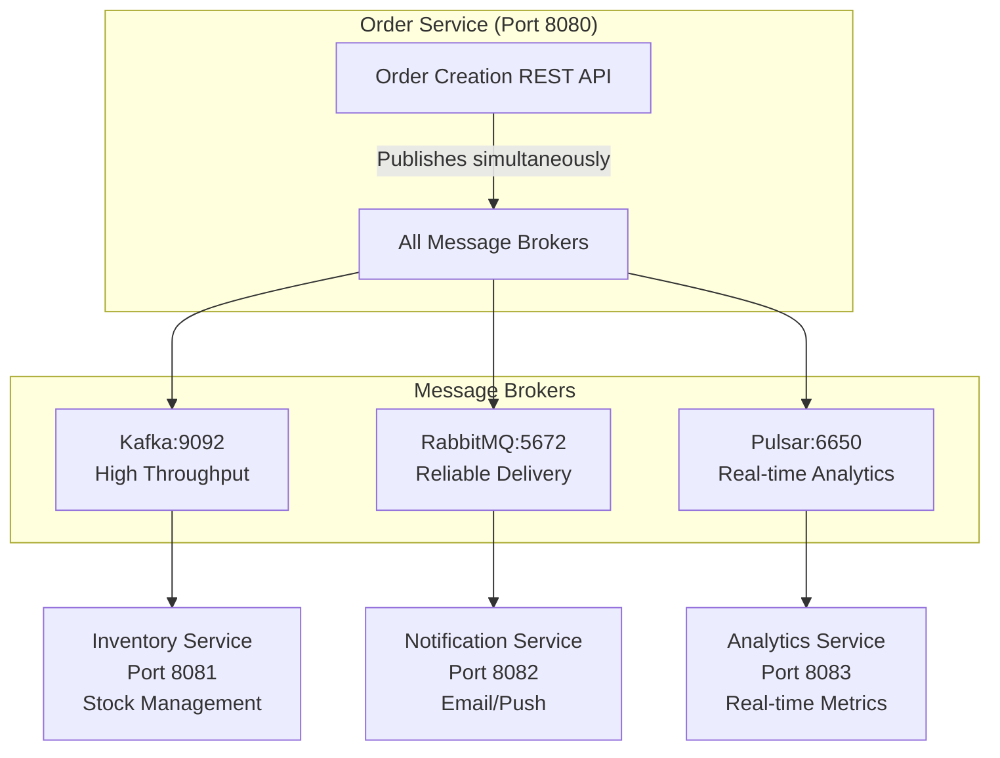
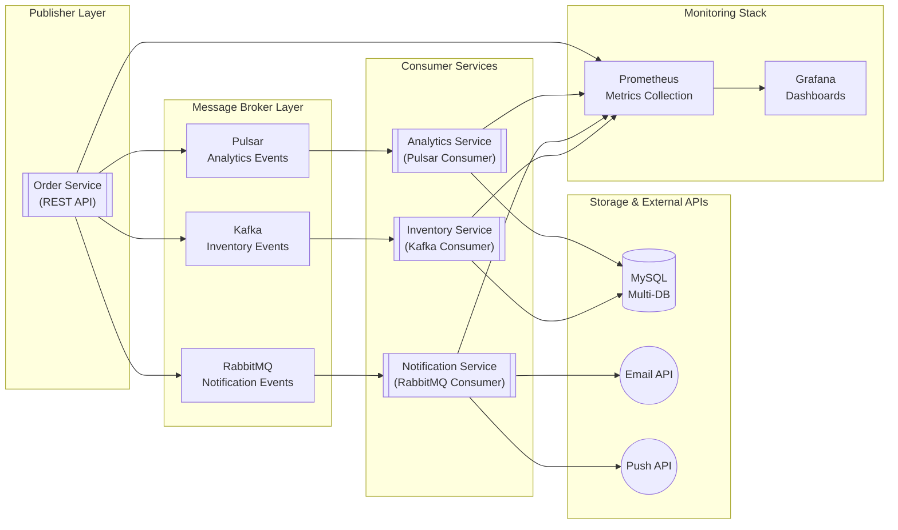

# Message Bus PoC - Multi-Broker Comparison

This project is a Proof of Concept (PoC) comparing message brokers (Kafka, RabbitMQ, and Pulsar) in a Spring Boot microservices architecture. The implementations simulate a flash sale order event processing system to evaluate message broker performance, cost, and features across domain-based services.

## Project Overview

This is a multi-module Spring Boot application designed to evaluate message brokers based on real-world scenarios. Each consumer service is dedicated to a specific broker for direct comparison:

- **Kafka**: High-throughput inventory management with optimistic locking
- **RabbitMQ**: Reliable notification delivery (email/push)
- **Pulsar**: Real-time analytics and metrics aggregation

## Architecture

### Multi-Module Structure
```
message-bus-poc/
├── settings.gradle                 # Multi-module configuration
├── build.gradle                   # Parent build with common dependencies
├── docker-compose.yml             # Multi-container orchestration
├── shared/                        # Common module (events, config, utils)
├── order-service/                 # Publisher only - REST API + event publishing
├── inventory-service/             # Kafka consumer only
├── notification-service/          # RabbitMQ consumer only
└── analytics-service/             # Pulsar consumer only + analytics REST API
```

### Service Responsibilities
- **shared**: Common event DTOs, configurations, serialization utilities
- **order-service**: REST API for order creation, publishes to all 3 brokers simultaneously
- **inventory-service**: Kafka consumer for stock management with database transactions
- **notification-service**: RabbitMQ consumer for email/push notification delivery
- **analytics-service**: Pulsar consumer for real-time analytics with REST API endpoints

## Quick Start

### Prerequisites
- Java 17+
- Docker & Docker Compose
- Gradle 8.x

### Running the Application

1. **Start infrastructure services**:
   ```bash
   docker-compose up mysql kafka rabbitmq pulsar prometheus grafana
   ```

2. **Build all modules**:
   ```bash
   ./gradlew build
   ```

3. **Run services individually** (for development):
   ```bash
   ./gradlew :order-service:bootRun
   ./gradlew :inventory-service:bootRun
   ./gradlew :notification-service:bootRun
   ./gradlew :analytics-service:bootRun
   ```

4. **Or run full stack with Docker**:
   ```bash
   docker-compose up --build
   ```

### Service Endpoints
- **Order Service**: http://localhost:8080 (REST API for order creation)
- **Analytics Service**: http://localhost:8083 (Analytics REST API)
- **Grafana Dashboard**: http://localhost:3000 (admin/admin)
- **RabbitMQ Management**: http://localhost:15672 (admin/admin)
- **Prometheus**: http://localhost:9090

## Load Testing

K6 load tests are included in the `k6/` directory:

```bash
# Smoke test
k6 run k6/order-smoke-test.js

# Load test
k6 run k6/order-load-test.js
```

## Requirements & Specifications

### Functional Requirements
* **Order Event Publication**: Publish JSON messages to broker-specific topics/exchanges upon order creation
* **Per-Customer Ordering**: Ensure messages for the same `customerId` are processed in sequence
* **Inventory Update**: Kafka-based inventory service decrements stock with optimistic locking
* **Notification Delivery**: RabbitMQ-based service handles email and push notifications
* **Real-Time Analytics**: Pulsar-based service aggregates events into real-time statistics
* **Fault Recovery**: Guarantee no message loss with broker-specific retry mechanisms

### Non-Functional Requirements
* **Throughput**: Peak of 5,000 TPS; average of 1,000 TPS
* **Latency**: End-to-end latency under 200 ms
* **Availability**: 99.9% uptime with broker clustering
* **Fault Tolerance**: Each broker cluster tolerates node failures
* **Scalability**: Horizontal scaling support for consumer instances
* **Monitoring**: Comprehensive metrics via Prometheus/Grafana

## Architecture Diagrams

### Message Flow Architecture


### System Component Architecture


## Technology Stack

### Core Technologies
- **Java 17** with Spring Boot 3.5.4
- **Spring Cloud Stream** for message broker abstraction
- **Spring Data JPA** for database operations
- **MySQL 8.0** for persistent storage
- **Lombok** for boilerplate reduction

### Message Brokers
- **Apache Kafka 7.4.0** - High-throughput streaming
- **RabbitMQ 3.12** - Reliable message queuing
- **Apache Pulsar 3.1.0** - Real-time analytics streaming

### Infrastructure & Monitoring
- **Docker Compose** for multi-service orchestration
- **Prometheus** for metrics collection
- **Grafana** for monitoring dashboards
- **K6** for load testing

## Development & Testing

### Development Workflow

#### For code changes to a specific service:
```bash
# 1. Build the specific module
./gradlew :order-service:build

# 2. Rebuild and restart only that service (fast)
docker-compose up -d --no-deps --build order-service
```

#### For dependency/configuration changes:
```bash
# 1. Build all modules
./gradlew build

# 2. Restart affected services
docker-compose up -d --build
```

#### Complete rebuild workflow:
```bash
# 1. Stop everything
docker-compose down

# 2. Clean build all modules
./gradlew clean build

# 3. Start fresh
docker-compose up -d --build
```

#### Quick verification:
```bash
# Check service health
docker-compose ps

# View logs for specific service
docker-compose logs -f order-service

# View all service logs
docker-compose logs -f
```

### Multi-Module Build Commands
```bash
# Build all modules
./gradlew build

# Build specific module
./gradlew :order-service:build
./gradlew :inventory-service:build
./gradlew :notification-service:build
./gradlew :analytics-service:build

# Run tests
./gradlew test

# Test specific module
./gradlew :shared:test
./gradlew :order-service:test

# Clean build
./gradlew clean
```

### Docker Development Options
```bash
# Full stack with all services
docker-compose up --build

# Infrastructure only (for local development)
docker-compose up mysql kafka rabbitmq pulsar prometheus grafana

# Start services in background
docker-compose up -d --build

# Scale specific consumers for load testing
docker-compose up --scale inventory-service=3 --scale notification-service=2

# Stop specific service
docker-compose stop order-service

# Remove containers and networks
docker-compose down
```