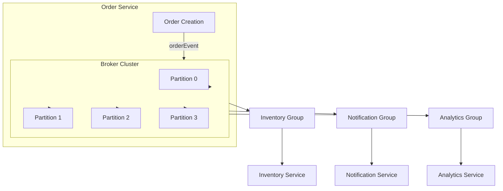
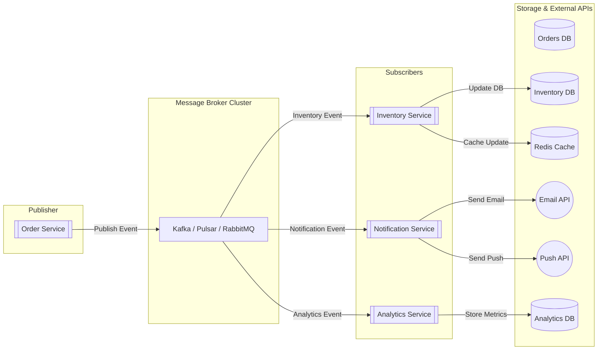

# Overview

This project is a Proof of Concept (PoC) for Kafka, RabbitMQ, and Pulsar. The implementations provided are not perfect and may lack complete understanding, so please use the code only as a reference.

# Project Background

The author aimed to evaluate message brokers based on the following criteria:

* Spring ecosystem friendliness
* Support for topic-based event publication
* Support for consumer group-based consumption
* Cloud support or requirement for a standalone server
* Ability to scale out horizontally
* Size and activity of the user community
* Support for debounce and throttling mechanisms
* Configurable dead-letter queue policies
* Support for consumer priority reads
* Guarantees on order of message acknowledgement
* Visibility into internal broker events
* Support for CDC plugins (e.g., Debezium)
* Estimated monthly cost on AWS for 200,000 TPS
* Estimated monthly cost on Oracle Cloud for 200,000 TPS
* Estimated monthly cost for on-premises setup at 200,000 TPS
* Overall average monthly cost for 200,000 TPS

Despite extensive research, most resources simply recommend Kafka for its comprehensive feature set. However, cost considerations are significant: paying \$8,500/month for Kafka versus \$950/month for RabbitMQ represents a substantial difference. To determine the optimal choice, a hands-on PoC was undertaken.

# PoC: Flash Sale Order Event Processing

## 1. Functional Requirements

* **Order Event Publication**: Publish JSON messages to the `order-events` topic/exchange upon order creation.
* **Per-Customer Ordering**: Ensure messages for the same `customerId` are processed in sequence.
* **Inventory Update**: Inventory Service consumes messages to decrement stock and handle out-of-stock scenarios.
* **Notification Delivery**: Invoke email and push notification services upon order completion.
* **Real-Time Analytics**: Analytics Service aggregates incoming events into real-time order statistics.
* **Fault Recovery**: Guarantee no message loss and support retrying after broker failures.

## 2. Non-Functional Requirements

* **Throughput**: Peak of 5,000 TPS; average of 1,000 TPS.
* **Latency**: End-to-end latency under 200 ms.
* **Availability**: 99.9% uptime.
* **Fault Tolerance**: Broker cluster tolerates one node failure.
* **Scalability**: Horizontal scaling of consumer instances from 1 to 5.
* **Monitoring & Logging**: Track consumer lag, throughput, latency, and error rates.

## 3. Flow Chart (Mermaid)

## 4. High-Level Component Diagram (Mermaid)

